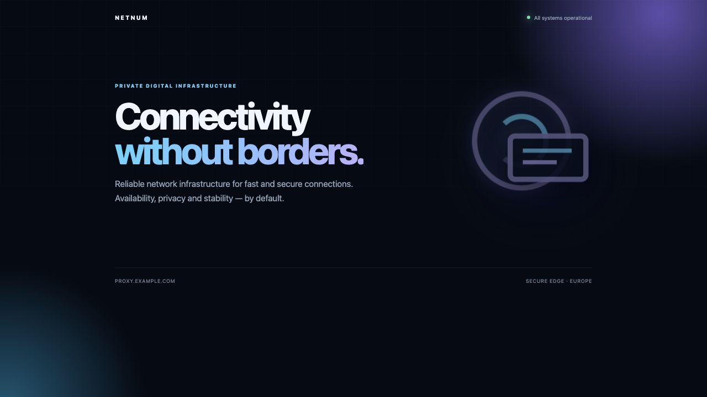
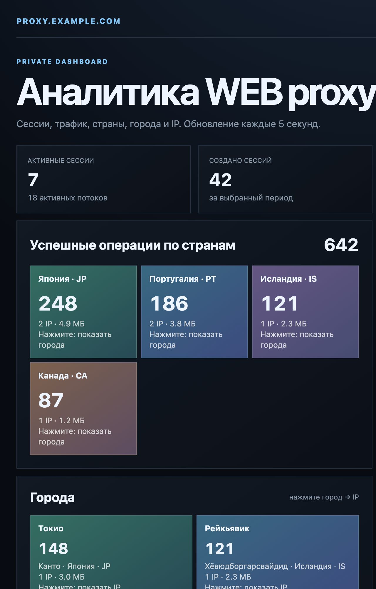
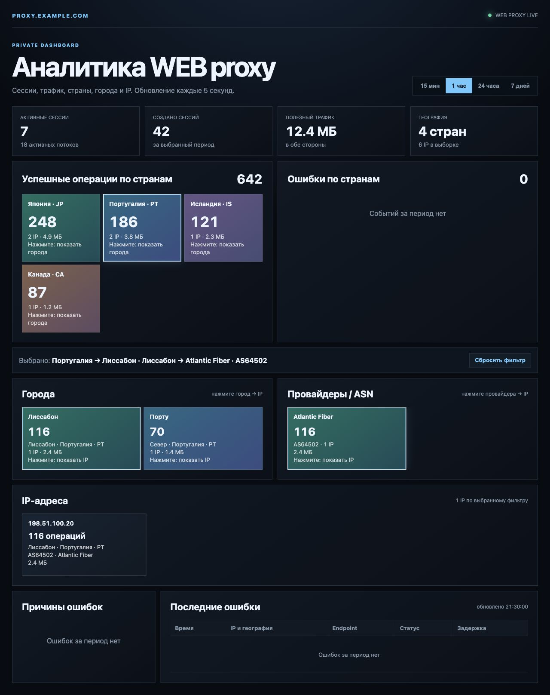

# WebProxyTelegram

Новая установка одной командой — установщик сам загрузит актуальную ветку
`main`, задаст вопрос о домене и выполнит всю настройку:

```bash
apt-get update && apt-get install -y curl ca-certificates && curl -fsSL 'https://raw.githubusercontent.com/Telemtinstall/telemt2/main/WebProxyTelegram/install.sh' -o /root/install.sh && bash /root/install.sh --auto
```

Если домен уже известен:

```bash
apt-get update && apt-get install -y curl ca-certificates && curl -fsSL 'https://raw.githubusercontent.com/Telemtinstall/telemt2/main/WebProxyTelegram/install.sh' -o /root/install.sh && bash /root/install.sh --auto --domain proxy.example.com
```

Повторный запуск этой команды сначала обновляет локальную копию репозитория в
`/opt/WebProxyTelegram`, а затем запускает находящийся в ней актуальный установщик.

## Пошаговая установка

Все домены, IP, города, ASN и названия провайдеров на скриншотах ниже —
демонстрационные. Они не содержат данные реального сервера.

### 1. Подготовьте домен

Создайте у DNS-провайдера запись `A`, направленную на публичный IPv4 чистого
сервера. Например:

```text
proxy.example.com  A  192.0.2.10
```

Дождитесь, когда домен начнёт возвращать адрес сервера. Публичные TCP-порты `80`
и `443` должны быть разрешены в firewall хостинга.

### 2. Запустите установщик

Выполните от `root` одну команду:

```bash
apt-get update && apt-get install -y curl ca-certificates && curl -fsSL 'https://raw.githubusercontent.com/Telemtinstall/telemt2/main/WebProxyTelegram/install.sh' -o /root/install.sh && bash /root/install.sh --auto --domain proxy.example.com
```

Замените `proxy.example.com` своим доменом. Установщик сам:

- обновит или загрузит репозиторий в `/opt/WebProxyTelegram`;
- установит nginx, certbot, WEB proxy и аналитику;
- выпустит сертификат Let’s Encrypt и включит автоматическое продление;
- создаст первого пользователя WEB proxy;
- сгенерирует логин и пароль для `/anal/`;
- сохранит все ссылки и пароли в защищённые файлы root.

Если команда запущена без `--domain`, установщик спросит домен. Затем можно
указать личный [IPinfo token](https://ipinfo.io/account/token) для стран,
городов, ASN и провайдеров или нажать Enter и добавить токен позднее в `/anal/`.

### 3. Проверьте публичную страницу

После установки откройте `https://ВАШ-ДОМЕН/`. Должна появиться маскирующая
страница с анимацией:



### 4. Получите ссылки и пароли

Главный итоговый файл:

```bash
cat /root/WebProxyTelegram-install-summary.txt
```

Дополнительные файлы:

```text
/root/WebProxyTelegram-links.txt
/root/WebProxyTelegram-analytics-credentials.txt
```

В первом находятся ссылки `https://t.me/webproxy` и `tg://webproxy` для
подключения Telegram. Во втором — адрес `/anal/`, логин и пароль аналитики.

### 5. Откройте аналитику

Перейдите на `https://ВАШ-ДОМЕН/anal/` и введите сгенерированные логин и пароль.
Панель показывает сессии, трафик, страны, города, провайдеров/ASN и IP:



Плитки интерактивны:

1. Нажмите страну, чтобы оставить её города.
2. Нажмите город, чтобы показать IP этого города.
3. Нажмите провайдера, чтобы оставить IP выбранного оператора.
4. Используйте «Сбросить фильтр», чтобы снова показать все данные.



### 6. Управляйте пользователями

```bash
webproxy_cli -list
webproxy_cli -add USER
webproxy_cli -del USER
webproxy_cli -delete USER
```

`-del` спрашивает подтверждение, `-delete` удаляет без дополнительного вопроса.
После изменений ссылки и итоговый файл обновляются автоматически.

Отдельный установщик только нового Telegram WEB proxy. Он не устанавливает
Telemt или VPN и не изменяет SSH/маршруты.

Исходные файлы опубликованы в каталоге `WebProxyTelegram` основной ветки репозитория
`Telemtinstall/telemt2`.

## Схема

```text
Internet 80/443 -> nginx -> tproxy-server 127.0.0.1:8080
                               -> public site / protected /anal/
                               -> official MTProxy 127.0.0.1:2398
```

Полностью без TLS frontend работать нельзя: WEB proxy использует HTTPS на 443.
Здесь применяется nginx, а сертификат выпускает certbot через HTTP-01/webroot.
Для официального MTProxy runner добавляет `--nat-info`, только если локальный
исходящий IPv4 отличается от внешнего; существующие VPN и маршруты не меняются.

## Требования

- чистый сервер;
- Debian 12/13 или Ubuntu 22.04–26.x;
- x86_64, systemd, root;
- DNS A домена указывает на сервер;
- публичны TCP 80 и 443.

## Локальный запуск из репозитория

```bash
chmod +x webproxy-install.sh
./webproxy-install.sh --auto
```

Будут заданы два коротких вопроса: домен и необязательный токен IPinfo. Получить
токен можно на <https://ipinfo.io/account/token>, регистрация —
<https://ipinfo.io/signup>. По умолчанию:

- email: `admin@DOMAIN`;
- WEB secret: генерируется;
- nginx принимает HTTP/HTTPS, certbot получает сертификат;
- `certbot.timer` автоматически проверяет продление;
- после успешного продления выполняется `nginx -t` и мягкий reload;
- создаётся красивая публичная страница;
- `/anal/` показывает только WEB proxy: сессии, потоки, трафик, ошибки и IP;
- географические плитки интерактивны: страна открывает свои города, город — IP,
  а отдельные плитки провайдеров/ASN фильтруют IP выбранного оператора;
- если указан личный токен [IPinfo](https://ipinfo.io/), аналитика добавляет плитки
  стран, городов и провайдеров/ASN; токен сохраняется только на сервере в
  `/etc/webproxy-analytics/ipinfo.token` с правами `0600`;
- если токен IPinfo пропущен, аналитика работает без стран и городов;
- токен можно позднее проверить и сохранить прямо на защищённой странице
  `/anal/`; если IPinfo отклонит или отзовёт его, интерфейс покажет код ошибки и
  предложит указать другой токен;
- логин и пароль аналитики генерируются по 10 символов;
- аналитика и кэш географии хранятся локально 7 дней в SQLite без MariaDB;
- один MTProxy worker и 4096 соединений;
- создаётся простой публичный сайт.

С доменом без вопросов:

```bash
./webproxy-install.sh --auto --domain proxy.example.com
```

Указать токен IPinfo без дополнительного вопроса:

```bash
./webproxy-install.sh --auto --domain proxy.example.com --ipinfo-token YOUR_TOKEN
```

Токен не записывается в итоговый файл установки и не публикуется в журнале.

Для реального публичного развёртывания лучше подготовить собственный сайт:

```bash
./webproxy-install.sh --auto --domain proxy.example.com --site-dir /root/my-site
```

В каталоге должен быть читаемый `index.html`. Уникальный настоящий сайт снижает
возможность обнаружения одинакового шаблона активным сканированием.

После установки ссылки находятся в `/root/WebProxyTelegram-links.txt`.
Доступ к аналитике находится в `/root/WebProxyTelegram-analytics-credentials.txt`.
Все важные данные дополнительно собраны в одном защищённом файле
`/root/WebProxyTelegram-install-summary.txt` с правами `0600`. Установщик выводит его
содержимое в конце успешной установки. Там находятся:

- домен и адрес публичной страницы;
- все пользователи WEB proxy и обе ссылки каждого пользователя;
- URL аналитики, её 10-символьные логин и пароль;
- команды `webproxy_cli`;
- пути ко всем важным конфигурационным файлам.

После добавления или удаления пользователя `webproxy_cli` автоматически обновляет
этот итоговый файл, поэтому актуальные ссылки не теряются.

Содержимое файла выглядит так:

```text
url=https://proxy.example.com/anal/
login=10-символьный-логин
password=10-символьный-пароль
```

Обновить аналитику уже установленного WEB proxy:

```bash
./webproxy-install.sh --analytics-only
```

## Управление пользователями

Установщик добавляет `/usr/local/sbin/webproxy_cli`. Каждый пользователь получает
отдельный WEB proxy secret и отдельную ссылку. Все пользователи используют общий
локальный MTProxy backend; upstream-лимит — 32 профиля.

```bash
webproxy_cli -add user
webproxy_cli -list
webproxy_cli -del user
webproxy_cli -delete user
```

`-del` запрашивает подтверждение. `-delete` удаляет сразу. Последнего пользователя
удалить нельзя, потому что `tproxy-server` требует хотя бы один профиль. Перед
изменением создаётся резервная копия, новая конфигурация проверяется, а при ошибке
служб автоматически восстанавливается прежняя версия. Все ссылки также сохраняются
в `/root/WebProxyTelegram-users.txt`.

Проверка автоматического продления:

```bash
systemctl status certbot.timer
certbot renew --dry-run
```
